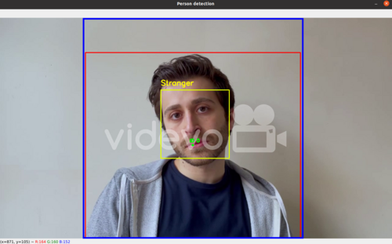
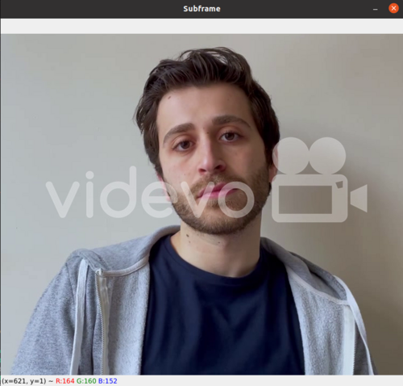

# Implementation

## Person detection

There are three modern DL techniques for object detection in images: Faster-RCNN, Single-Shot Detector (SSD), and You Only Look Once (YOLO). Each of these techniques has advantages and drawbacks we should take into account in order to select the one that best suits our specific purpose.

A complete comparison of all existing models’ precision metrics is not our goal. Our testing of the three methods with the same dataset showed that the best precision could be achieved with the Faster-RCNN method, slightly lower precision – with the SSD models, and the least precise results – with the YOLO network.

It appears that the faster the object detection method is, the less precision it provides. Thus we choose the happy medium – the SSD models, which can provide enough speed with sufficient precision.

Next, we looked for a ready-to-use SSD model that would be:
 - Small enough to run on Raspberry Pi with its limited computing resources
 - Trained to detect humans (the model may be able to detect other classes of objects as well - but its human detection accuracy is what matters for the application we’re creating)

The [MobileNet CNN](https://github.com/chuanqi305/MobileNet-SSD) is a suitable model which has been trained using the COCO dataset and could detect objects of twenty different classes, including humans, cars, dogs, and others. The selected DNN is realized as Caffe models which consists of two parts: the model structure (.prototxt) file and the trained model (.caffemodel). The Caffe model structure is written in a format similar to JSON. The trained model is a binary serialization of the CNN kernels and other trained data.

Our code implements a ```FrameProcessor class``` with size=300 because the models we use works with images sized 300 x 300 pixels. The scale and mean parameters have the same values that were used for the MobileNet model training. These values must always be assigned to the model’s training values, else the precision of the model decreases. The person_class value is 15 because human is the 15-th class in the model context. However, since the model was trained on square images it searches objects in centered square subframe (blue border on image below). FrameProcessor also excludes inner object boxes and object data is being transmitted to tracker and face recognizer. ```Tracker class``` instance handles centroids of found boxes for preventing assigning new id to previous person (green point).



## Face recognition

[Face recognition](https://github.com/ageitgey/face_recognition) was chosen as face processor. It is used to recognize and manipulate faces from Python with the world's simplest face recognition library. Built using dlib's state-of-the-art face recognition built with deep learning. The model has an accuracy of 99.38% on the [Labeled Faces in the Wild benchmark](http://vis-www.cs.umass.edu/lfw/).

```FaceRecognizer class (app/face_recognizer.py)``` proceeds each subframe (e.g., image below) from previous step with pickle encoded model of known faces and returns the result. After the tracked ids and recognized faces results are being matched and accumulated in internal dictionary. After length of detections for single id exceeds the hardcoded threshold value the id is being freezed for future matching with most common detected value, which is being assigned to the id object regardless to face recognition result in future.



## Frame processing

The simplest way of adapting the algorithm to the real-time mode is dividing it into parts and running these parts in parallel. The "fast" part will run at its real-time speed, and the "slow" part will run at some low FPS value. But because the parts will run asynchronously, we can process the "slow" part (of the SSD model and face recognition) and only those frames that merit it.

For speeding up frames handling ```RealtimeVideoDetector class (app/video_detector.py)``` realizes the idea of asynchronous processing. The ```detect``` method of the class receives the path to a video file, the number of the person class, and the confidence threshold. First, it creates the capture for the video stream and the queues for frames and person detection. Then, it initializes an instance of the ```Process``` class with the specified parameters. One of these is the ```detect_in_process``` function, which will run with the process. The detection process runs in the background.

Further on, we loop over all the received frames. With getting a new frame, we look at the frame queue and, if it is empty, we put the frame into the queue. The background process looks at the queue and starts working on the frame; when done, the process puts the result into the person queue.

The frame processing loop looks at the person queue and, if there is a detection, it draws it on the current frame. So, if a person is detected in a frame, that person is shown in the frame that resulted from the detection of previous, not the original frame.

One more trick here is in the frame processing loop. Then we turn the frame processing to sleep mode to force it to slow down. In this case, we reduce its speed to about 25 FPS (by delay value) to get the actual frame rate of test video. Additionally videostream itself runs in separate thread (using imutils package).
